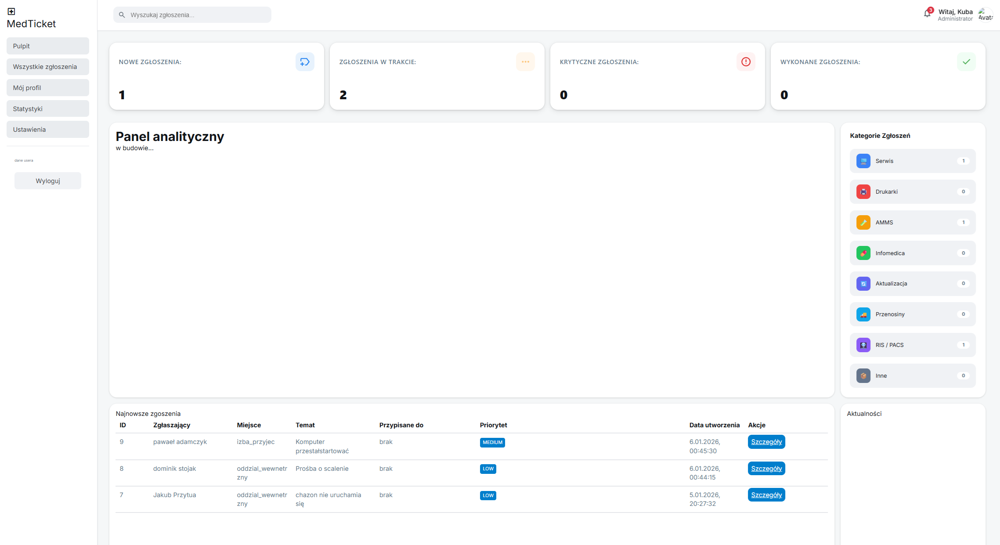

# MedTicket

System zgłoszeniowy do wewnętrznego zgłaszania problemów technicznych i utrzymaniowych w szpitalu/placówce medycznej.

## Opis projektu

Ticket-System to prosty, wewnętrzny system ticketowy umożliwiający pracownikom szybkie zgłaszanie awarii i problemów z zakresu:

- Informatyki (IT)
- Aparatury medycznej
- Instalacji elektrycznych
- Utrzymania budynku
- Cyberbezpieczeństwa
- Innych kategorii

System pozwala na wybór miejsca zdarzenia, działu docelowego, priorytetu oraz powtarzalności problemu.

## Road Map

### Etap 0 – Struktura projektu
- Poprawienie i uporządkowanie struktury plików w folderze `app`

### Etap 1 – Walidacja formularza
- Dodanie pełnej walidacji po stronie klienta (JavaScript) do formularza zgłoszeniowego  

### Etap 2 – Poprawki na stronie potwierdzenia
- Usunięcie błędów przy drukowaniu strony „Thank You”
- Poprawne drukwanie oraz kopiowanie numeru ID zgłoszenia

### Etap 3 – Panel wyboru działów
- Dodanie dedykowanej strony z wyborem działów (IT, Elektrycy, Budowlany, Aparatura medyczna, Cyberbezpieczeństwo itp.)

### Etap 4 – Panel zgłoszeń
- Strona listy wszystkich zgłoszeń
- Szczegółowy widok pojedynczego zgłoszenia

### Przyszłe funkcjonalności
- System logowania użytkowników
- Profil użytkownika z historią zgłoszeń
- Przypisywanie zgłoszeń do konkretnych osób/techników
- Statusy zgłoszeń (nowe, w trakcie, zamknięte)
- Powiadomienia e-mail
- Eksport danych

## Technologie
- HTML / CSS / JavaScript / ejs
- Backend – Node.js, express
- Baza danych – mariaDB

## Jak uruchomić lokalnie
- git clone https://github.com/gresh0wy/Ticket-System.git
- git push -u origin main

# instrukcje uruchomienia serwera (do uzupełnienia)
- npm run dev

# Budowa pliku .env
- MARIADB_ROOT_PASSWORD="pass"
- MARIADB_DATABASE_NAME="dbName"
- MARIADB_USER="username"
- MARIADB_HOST=localhost
- MARIADB_PORT=port

## 📸 Podgląd aplikacji

---

### Strona główna

  

---

### Ekran z podsumowanie zgłoszenia

  

---

### Dashboard – widok główny

  

---

### Dashboard – szczegóły

  

---

### Logowanie

  

---

### Strona błędu 404

  

> **Informacja dotycząca bezpieczeństwa**
>
> Ze względów bezpieczeństwa w wersji projektu udostępnionej na GitHubie **nie został zaimplementowany system logowania ani inne funkcjonalności**, które mogłyby stanowić potencjalne zagrożenie dla bezpieczeństwa wewnętrznych danych.
>
> Pełna wersja aplikacji, zawierająca mechanizmy **uwierzytelniania**, **autoryzacji** oraz dodatkowe zabezpieczenia, jest przeznaczona wyłącznie do użytku wewnętrznego w środowisku, w którym system zostanie docelowo wdrożony.
>
> Repozytorium publiczne prezentuje jedynie **część funkcjonalną i techniczną projektu** w celach demonstracyjnych oraz edukacyjnych.
>
> **W celu uzyskania dostępu do pełnej wersji systemu zapraszam do kontaktu.**
